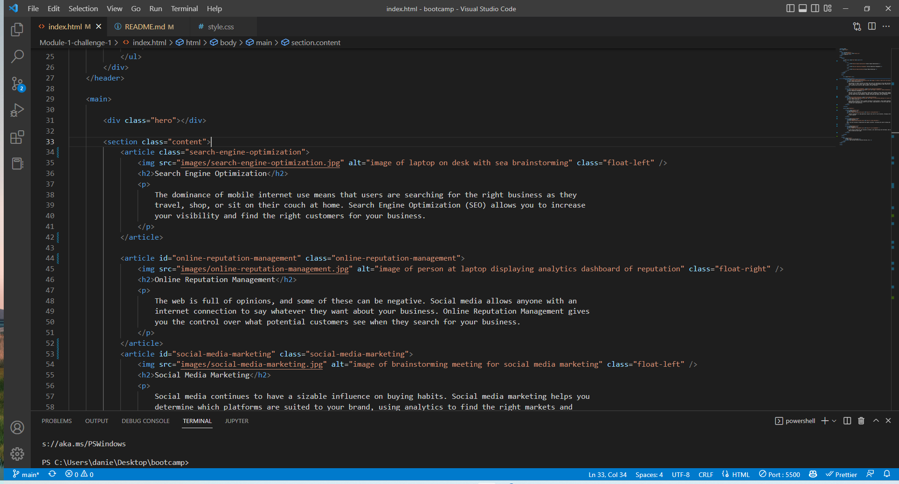

# SEO - Week One Challenge 
## Code Refactoring

----

### User Story

```
AS A marketing agency
I WANT a codebase that follows accessibility standards
SO THAT our own site is optimized for search engines
```

### Acceptance Criteria

Your website must meet accessibility standards. You can achieve this completing the following:

* Semantic HTML elements can be found throughout the source code
* HTML elements follow a logical structure independent of styling and positioning
* Image and icon elements contain accessible `alt` attributes
* Heading attributes fall in sequential order
* Title elements contain a concise, descriptive title

---

# The work i did in this challenge


## Link to the deployement

<a href="https://daniel-boxall.github.io/Module-1-challenge/">github.com/daniel-boxall</a>

---

### HTML refactored

The HTML in index.html was refactored to follow best practices for semantic HTML and also the SEO was refactored by placing alt attributes 
in all the images allowing assistive technologies to able to read the contents of the web page there by placing the website hire in 
Search Engine results.

---

### Screen shot of the code



---

### Resources:

* [Semantic HTML](https://www.w3schools.com/html/html5_semantic_elements.asp)
* [Image `alt` attributes](https://www.w3schools.com/tags/att_img_alt.asp)